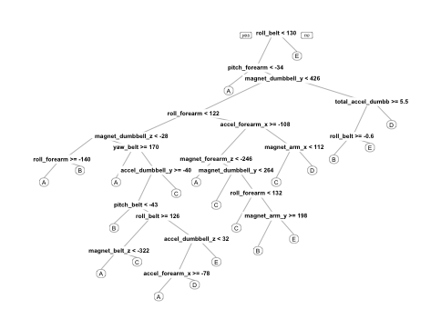

## Introduction  
Using devices such as Jawbone Up, Nike FuelBand, and Fitbit it is now possible to collect a large amount of data about personal activity relatively inexpensively. These type of devices are part of the quantified self movement ??? a group of enthusiasts who take measurements about themselves regularly to improve their health, to find patterns in their behavior, or because they are tech geeks. One thing that people regularly do is quantify how much of a particular activity they do, but they rarely quantify how well they do it.  

In this project, we will use data from accelerometers on the belt, forearm, arm, and dumbell of 6 participants to predict the manner in which they did the exercise.

## Load required libraries
```{r}
library(caret)
library(rpart)
library(rpart.plot)
library(randomForest)
library(e1071)
```
## Collect the required data
```{r, cache = T}
# The training and test data url.
trainingDataUrl <- "https://d396qusza40orc.cloudfront.net/predmachlearn/pml-training.csv"
testDataUrl <- "https://d396qusza40orc.cloudfront.net/predmachlearn/pml-testing.csv"

# Create input_data folder.
if(!file.exists("./input_data")) {
  dir.create("./input_data")
}

# Downloading and storing data locally.
trainingDataFile <- "./input_data/training_data.csv"
testDataFile <- "./input_data/test_data.csv"

if(!file.exists(trainingDataFile)) {
  download.file(trainingDataUrl, destfile = trainingDataFile, method = "curl")
}

if(!file.exists(testDataFile)) {
  download.file(testDataUrl, destfile = testDataFile, method = "curl")
}

# Read the data.

trainingDataRaw <- read.csv(trainingDataFile)
testDataRaw <- read.csv(testDataFile)

trainingDataRawDim <- dim(trainingDataRaw)
testDataRawDim <- dim(testDataRaw)

print(paste("Training Data Dimensions: ", trainingDataRawDim[1], "*", trainingDataRawDim[2]))
print(paste("Test Data Dimensions: ", testDataRawDim[1], "*", testDataRawDim[2]))
```
The classe is the outcome variable we are going to predict.

## Cleaning the data.
```{r, cache = T}
sum(complete.cases(trainingDataRaw))
```
Since, we have missing values, lets start cleaning data by removing columns with missing(N/A) values.

# Removing the columns containing the missing values.
```{r, cache = T}
trainingDataRaw <- trainingDataRaw[ ,colSums(is.na(trainingDataRaw)) == 0]
testDataRaw <- testDataRaw[ ,colSums(is.na(testDataRaw)) == 0]
colnames(trainingDataRaw)
```

Since we are interested with the data from accelerometers on the belt, forearm, arm, and dumbell, user_name, window and timestamp variables won't contribute for the outcome. Lets get rid of these columns.

```{r, cache = T}
trainingToRemove <- grepl("^X|timestamp|window|user_name", names(trainingDataRaw))
testToRemove <- grepl("^X|timestamp|window|user_name", names(testDataRaw))

trainingDataRaw <- trainingDataRaw[ , !trainingToRemove]
testDataRaw <- testDataRaw[ , !testToRemove]
```

Get rid of the data that are not numeric too.
```{r, cache = T}
classe <- trainingDataRaw$classe
trainingDataCleaned <- trainingDataRaw[, sapply(trainingDataRaw, is.numeric)]
trainingDataCleaned$classe <- classe

testDataCleaned <- testDataRaw[, sapply(testDataRaw, is.numeric)]
```
## Partation the training data into pure training and validation set.
We split the cleaned training set into a pure training data set (75%) and a validation data set (25%). We will use the validation data set to conduct cross validation in future steps.

```{r, cache = T}
set.seed(113456)

inTrain <- createDataPartition(trainingDataCleaned$classe, p=0.75, list=F)
trainingData <- trainingDataCleaned[inTrain, ]
validationData <- trainingDataCleaned[-inTrain, ]
```

## Using algorithm for prediction.

I prefer using Random Forest algorithm to fit a predictive model for activity recognition as Random Forests are often the winner for lots of problems in classification. Also Random Forests automatically selects important variables and is robust to correlated covariates & outliers in general. We will use 5-fold cross validation when applying the algorithm.
```{r, cache = T}
controlRandomForest <- trainControl(method="cv", 5)
modelRandomForest <- train(classe ~ ., data=trainingData, method="rf", trControl=controlRandomForest, ntree=200)
modelRandomForest
```

## Estimating the performance of the model in the validation sets.
```{r, cache = T}
predictRandomForest <- predict(modelRandomForest, validationData)
confusionMatrix(validationData$classe, predictRandomForest)


accuracy <- postResample(predictRandomForest, validationData$classe)
out_of_sample_error <-  1 - as.numeric(confusionMatrix(validationData$classe, predictRandomForest)$overall[1])
out_of_sample_error
accuracy
```
Hence the estimated accuracy of the model is 99.51% and the estimated out of sample error is 0.48%

## Predicting for Test Data Set
Applying the model to predict for the testing data set we had download previously from the provided source.Since, there is problem_id in the data, lets remove that.
```{r, cache = T}
result <- predict(modelRandomForest, testDataCleaned[, -ncol(testDataCleaned)])
result
```

## Decision tree visualization
```{r, cache = T}
treeModel <- rpart(classe ~ ., data=trainingData, method="class")
prp(treeModel)
```
image: 
